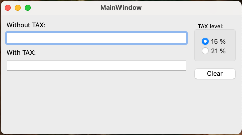

# TaxCalculator example app

This repository contains a simple example application built using [Qt 6](https://www.qt.io/product/qt6). 
Its main purpose is to showcase the capabilities of the **QtWidgets** framework, with a focus on the **GUI designer**, **translations**, **resource management**, and dedicated **application settings** storage handling.

This example is **NOT** set of best practices or example of UI design guidlines! 

### Relevant Links:
- [Qt 6 Official Documentation](https://doc.qt.io/qt-6/)
- [QtWidgets Module Overview](https://doc.qt.io/qt-6/qtwidgets-index.html)
- [Qt Resource System](https://doc.qt.io/qt-6/resources.html)
- [Qt Linguist and Translations](https://doc.qt.io/qt-6/qtlinguist-index.html)



## 🔨 How to use this example

To get started with this example, make sure you have [Qt](https://www.qt.io/product/qt6) installed on your system. Once Qt is installed, follow these steps:

1. Open the `CMakeLists.txt` file, either in [Qt Creator](https://www.qt.io/product/development-tools) or any other preferred IDE that supports CMake.
2. Configure and compile the project using your chosen IDE's build process.
3. After compilation, you should be able to run the application to see the QtWidgets features in action.

For more details on compiling with CMake, you can refer to the [CMake Documentation](https://cmake.org/documentation/).

## 🌐 Multilingual Support

Qt library supports multilanguage environment by applying set of configurations and using two externals toosl: lupdate, lrelease. 

The steps necessary to develop multilanguage application are:

1. Modify the `CMakeLists.txt`
   * [Specify target languages](./CMakeLists.txt#L15-L16)
   * [Enable translation steps in compilation process](./CMakeLists.txt#L37-L37)
   * [Remove original template translate files (if presented)](./CMakeLists.txt#L24-L24)
   * [Disable original template configurations (if presented)](./CMakeLists.txt#L51-L52), [etc. ](./CMakeLists.txt#L38-L38)
2. Generate translation files by calling lupdate (or enable corresponding build steps in configuration of your IDE)
3. Translate the string by using QLinquist app or by any text editor
4. Compile your application
5. Implement business logic to switch languages

```c++
   //mainwindow.h 
   QTranslator translator;
   
   //mainwindow.cpp
   if (translator.load(":/i18n/SimpleTaxCalc_en.qm"))
      QCoreApplication::installTranslator(&translator);
   ui->retranslateUi(this);
```
